# ULX3S Examples - Lattice Diamond Blinky

This blinky is based on the [ULX3S-Blinky project](https://github.com/DoctorWkt/ULX3S-Blinky) from @Doctorwkt. This example blinks an LED using FPGA code.

The existing Diamond project can be loaded by opening the Diamond.lpf project file. 

Alternatively, to create a Lattice Diamond project, click on File - New - Project ...


Give the project a name, in this case "Diamond", then click "Next":

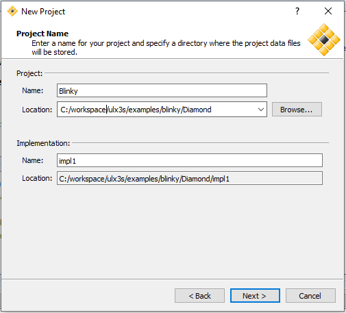

add the `blinky.v` source file, then click "Next".

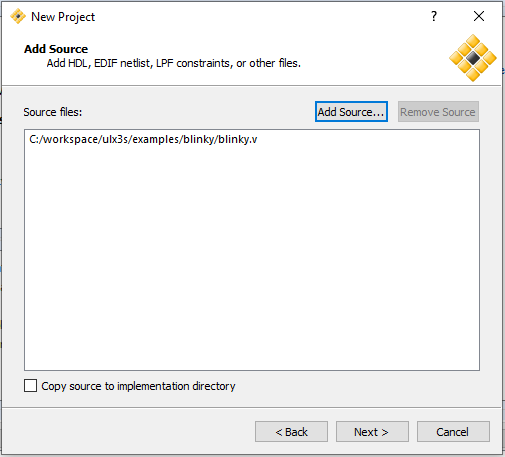
 
specify your target (in this case a 12F is shown), then click "next":

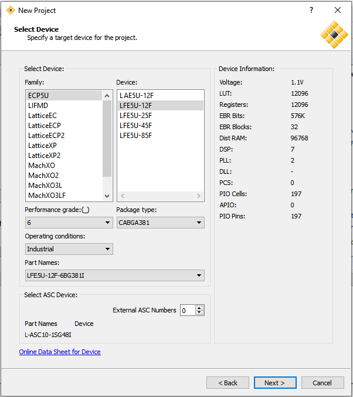

The default is Lattise LSE, then click "Next":

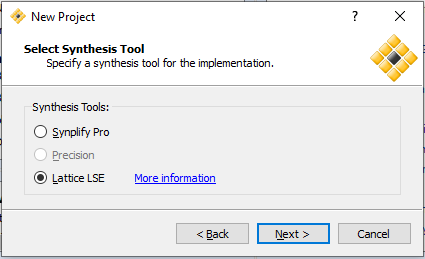

Project summary information will be shown, then click "Next":

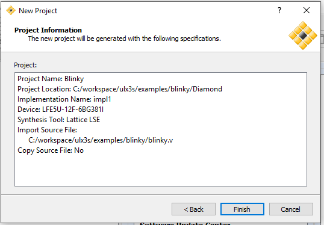

next, add the [lpf constraint file](../doc/constraints/ulx3s_v20.lpf) to the project (or copy the contents to `Blinky.lpf`):

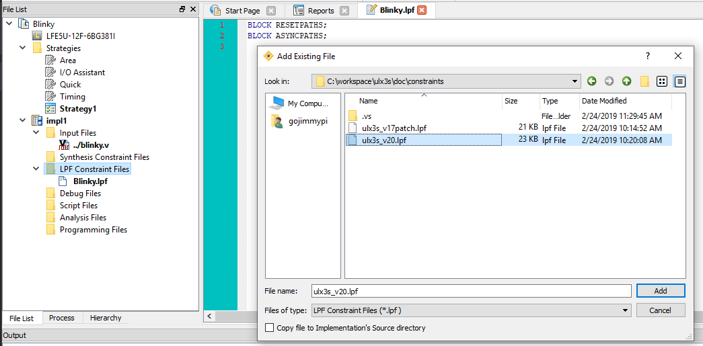

To make the bitfile, click on the Process tab, and check the `Bitstream File` checkbox in the `Export Files` section. Then right-click and select "Run:

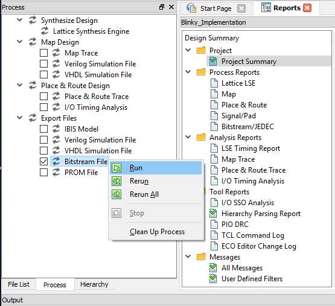

If the file was created successfully, there will be an indication in the Output View:

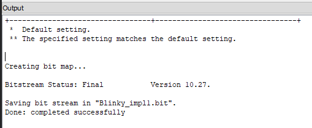

Unfortunately, Lattice Diamond does not see the FTDI FT232 chip:

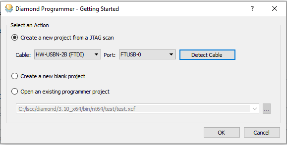

So we'll need to use the [ujprog](https://github.com/f32c/tools/tree/master/ujprog) utility. Precompiled binaries can be found in [emard/ulx3s-bin](https://github.com/emard/ulx3s-bin), such as [this one](https://github.com/emard/ulx3s-bin/tree/master/usb-jtag/win64mingw).

Note there may be some issues running the Windows version in WSL. See https://github.com/f32c/tools/issues/8 and https://github.com/f32c/tools/pull/9, specifically it seems when [launching from VoIFS](https://github.com/f32c/tools/pull/9#issuecomment-465693978) in WSL. See also [this blog](https://gojimmypi.blogspot.com/2019/02/ulx3s-ujprog-on-windows-wsl-or-minggw.html) for tips on compiling `ujprog` for Windows.

The bitfile can be found in the implementation directory (in this case Blinky_Implmentation):

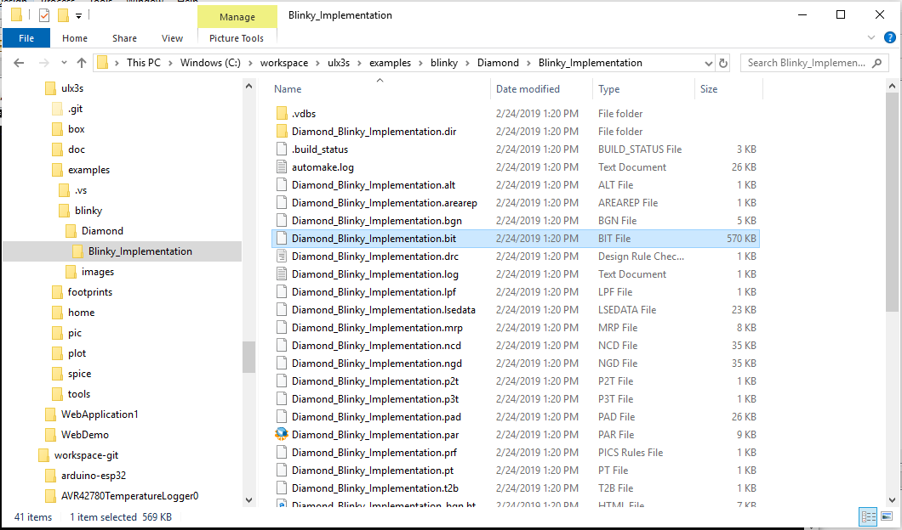

You can open a DOS command prompt at the location of the binary file simply by typing `CMD` in the path, and press enter:

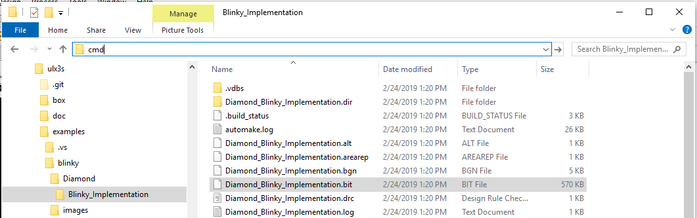

Assuming the f32c tools are in `c:\workspace\f32c_tools\` like this:

```
c:
cd\workspace
git clone https://github.com/f32c/tools.git f32c_tools
```

The bitfile can be uploaded like this:

```
\workspace\f32c_tools\ujprog\ujprog.exe Diamond_Blinky_Implementation.bit
```


If the LED's are not blinking, ensure the proper ldf file is in bold as the Active Preference File.

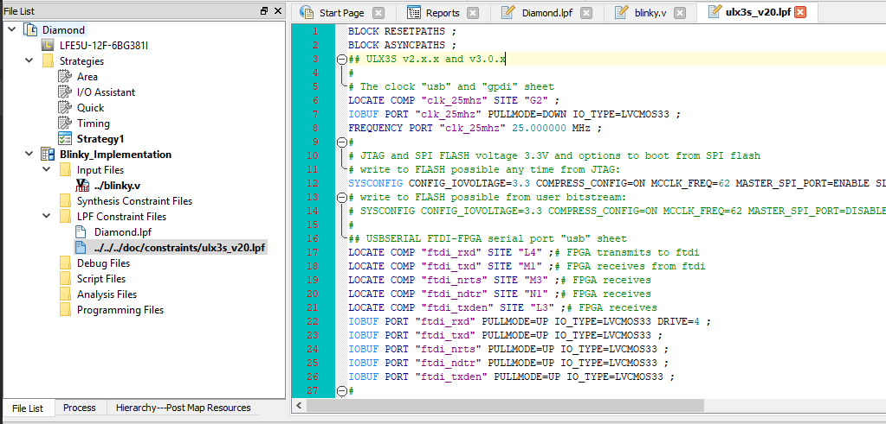

While reviewing the `blinky.v` file, note there's an assignment: `assign i_clk= clk_25mhz;` 

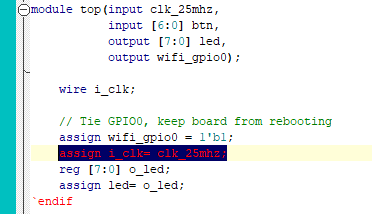

that assigns our local varable `i_clk` to the constraint file item `clk_25mhz` which is connected to our chip at pin "G2" as shown in the LPF Constraint File:

```
# The clock "usb" and "gpdi" sheet
LOCATE COMP "clk_25mhz" SITE "G2";
IOBUF PORT "clk_25mhz" PULLMODE=NONE IO_TYPE=LVCMOS33;
FREQUENCY PORT "clk_25mhz" 25 MHZ;
```

Here is G2 in Package View:

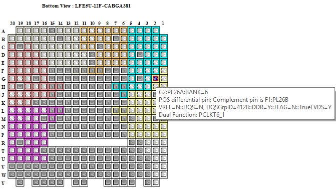

Similarly, the `o_led[6]` is assigned the value of the `Fire1` button, `btn[1]` (chip site pin "R1")

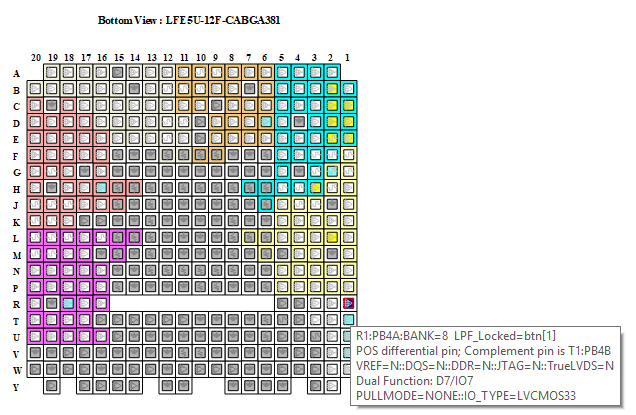

From the schematic, the `FIRE1` button is named `BTN_F1`:

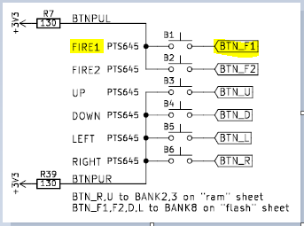

And connected to `R1` of BANK-8 of the LFE-5U:

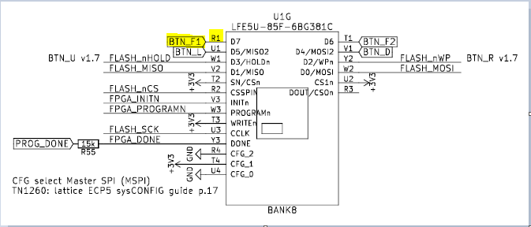

Similarly, the array of LED values (bits 0..5) are connnected to our counter to simulate blinking:

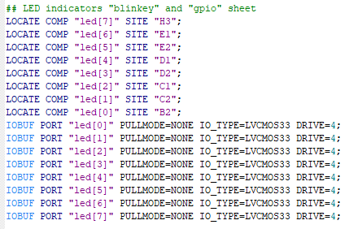

Note bit position 7 `o_led[7]` is fixed at "1" (on), and position 6 `o_led[7]` is connected to the `btn[1]` button and thus is only illumintated when the FIRE1 button is pressed.


See also [other examples](../../README.md)


