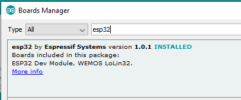
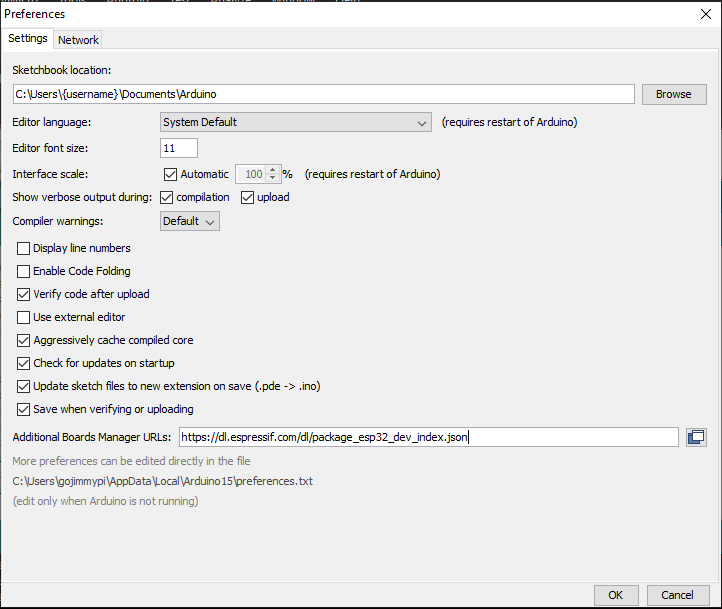
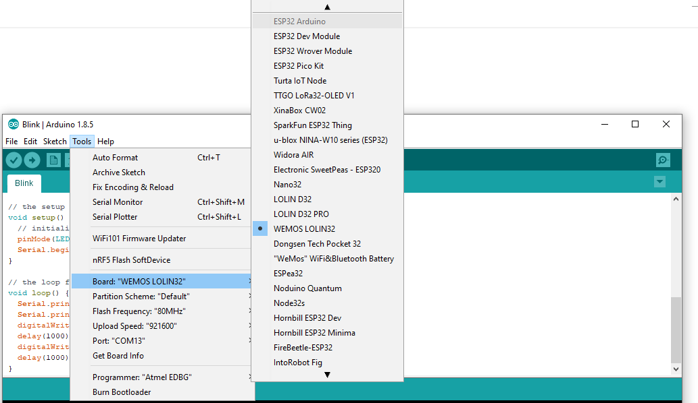
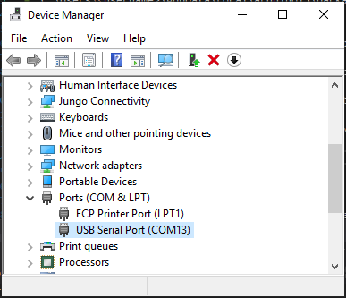

# ESP32 Blinky for ULX3S

In order to program the ESP32 on the ULX3S, the [PassThru FPGA](../../passthru/README.md) code needs to first be loaded.

Next, in the Arduino IDE ensure that the Espressif SDK 1.0.1 or later is installed.



If any problems are encountered, consider completely removing old `espressif` files that may be in one of these directories:

```
C:\Users\{username}\Documents\Arduino\hardware\
C:\Users\{username}\AppData\Local\arduino15\packages\esp32\
```

Then re-install the Espressif SDK 1.0.1 fresh from the Board Manager. The following URL may need to be added to the "Additional Boards Manager URLs" list:

https://dl.espressif.com/dl/package_esp32_dev_index.json



Once the Espressif boards are added to the Arduino IDE, select `WEMOS LOLIN32` from the `ESP32 Ardunio` section of the board selection menu.



Find the USB Port used by your ULX3S using Windows Device Manager and ensure it is selected for Tools - Port. Also note other settings:



The blinks app can be selected from File - Examples - 01.Basics - Blink, or use the code below that has Hello World added to serial output.

The ESP32 blinky app:
```
// the setup function runs once when you press reset or power the board
void setup() {
  // initialize digital pin LED_BUILTIN as an output.
  pinMode(LED_BUILTIN, OUTPUT); // LED_BUILTIN = 5, this is D22 on the ULX3S
  Serial.begin(115200);
}

// the loop function runs over and over again forever
void loop() {
  Serial.print("Hello world! Blink on port = ");
  Serial.println(LED_BUILTIN);
  digitalWrite(LED_BUILTIN, HIGH);   // turn the LED on (HIGH is the voltage level)
  delay(1000);                       // wait for a second
  digitalWrite(LED_BUILTIN, LOW);    // turn the LED off by making the voltage LOW
  delay(1000);                       // wait for a second
}
```

If an error like this is encountered, ensure the passthough app is active on the FPGA:

```
Serial port COM13
Connecting........_____....._____....._____....._____....._____....._____....._____

A fatal error occurred: Failed to connect to ESP32: Timed out waiting for packet header
```

In Ardunio, the`esptool.exe` is used to upload the binary ESP32 files, and is typically found here:

`C:\Users\{username}\AppData\Local\Arduino15\packages\esp32\tools\esptool_py\2.6.0\`

in WSL (replace `build_423515` with your build directory, and ttyS13 with your port):

```
python esptool.py --chip esp32                  \
            --port /ttyS13                      \
            --baud 921600                       \
            --before default_reset              \
            --after hard_reset write_flash      \
            -z                                  \
            --flash_mode dio                    \
            --flash_freq 80m                    \
            --flash_size detect 0xe000  /mnt/c/Users/$USER/AppData/Local/Arduino15/packages/esp32/hardware/esp32/1.0.1/tools/partitions/boot_app0.bin       \
                                0x1000  /mnt/c/Users/$USER/AppData/Local/Arduino15/packages/esp32/hardware/esp32/1.0.1/tools/sdk/bin/bootloader_dio_80m.bin \
                                0x10000 /mnt/c/Users/$USER/AppData/Local/Temp/arduino_build_423515/Blink.ino.bin                                            \
                                0x8000  /mnt/c/Users/$USER/AppData/Local/Temp/arduino_build_423515/Blink.ino.partitions.bin
```

or in the bin/ESP32 directory:

```

```

