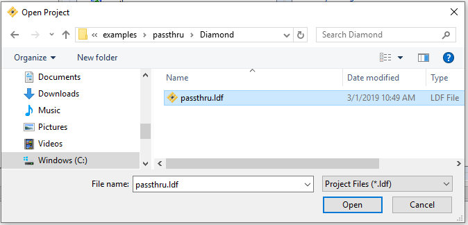
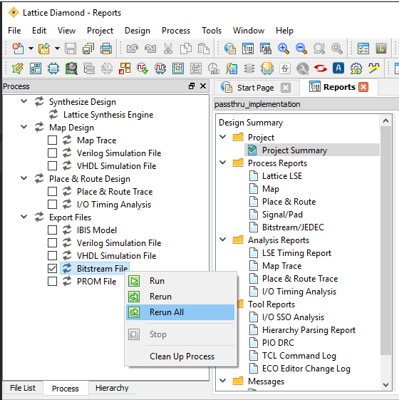

# Diamond passthru

This FPGA passthru app, needed to program the ESP32 since is it not directly accessible, is written in VHDL.

Open the Diamond lpf project file:

Next, click on the Process tab, check the Bitstream File checkbox, right-click "Run all": 

For a more detailed example using Diamondd, see the [Diamond Blinky Example](../../blinky/Diamond/README.md)

See also [other examples](../../README.md)
