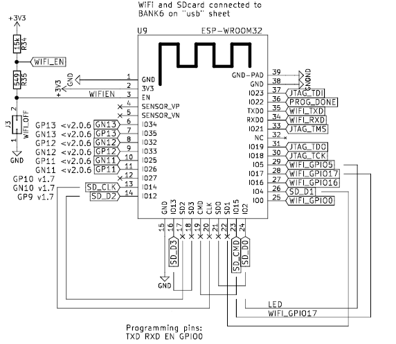

# passthru 

FPGA passthru app allowing programming of the ESP32. 

As shown in the [schematics](../../doc/schematics.pdf) (page 7), the ESP32 pins are not directly accessible, and need an FPGA signal PassThru to be loaded.

[PassThru in Lattice Diamond for Windows](./Diamond/README.md)

[PassThru using Open Source](./OpenSource/README.md)

